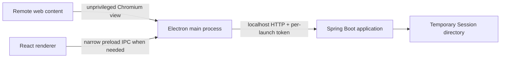

# Architecture

## Processes and responsibilities

Electron owns Chromium/WebContentsView, browser navigation, isolated cookies/storage, browser events, and eventual media detection/capture. Java is the trusted application layer for Quick Session domain behavior, temporary session state, metadata, and future package/cache services. Do not move browser-specific responsibilities into Java.

The renderer is currently a React placeholder. `desktop/main.cjs` launches Maven in development, creates a random token, passes it via environment to Spring Boot, and checks the authenticated health endpoint before creating the window. Startup fails closed if Maven exits, authentication fails, or the health check times out. A Spring servlet filter protects every `/api/**` endpoint; controllers do not implement their own token checks. Remote pages must never receive API access or the token.

The current development scaffold uses fixed loopback port `8765`; this is an implementation assumption, not a permanent architecture decision. On macOS, closing the last window leaves the app active and `activate` recreates the window without relaunching Maven. The Maven process runs in a separate process group so app quit can terminate the Maven/Spring process tree.

## Security boundaries

The desktop window enables `contextIsolation` and sandboxing and disables `nodeIntegration`. The preload exposes no API at this stage. Future integrated browsing should use Electron `WebContentsView`, not deprecated `BrowserView` or `<webview>`. Remote pages must remain isolated from privileged renderer APIs, filesystem access, and backend credentials. Keep browser profiles separate from the user's normal browser profiles; never import their cookies.

## Future capture flow

When capture is implemented, browser-specific detection should pass a small normalized request to Java (conceptually `CaptureRequest`), which owns session/domain behavior. Keep this abstraction small until more than one capture source exists. Standard images are the first planned source; adapters, drag/drop, paste, and extensions are future possibilities.

## Repository modules

- `desktop/`: Electron main/preload and Vite React/TypeScript renderer.
- `backend/`: Spring Boot Maven application.
- `docs/`: product and implementation constraints.

Production backend bundling and installers are not configured in this scaffold.
