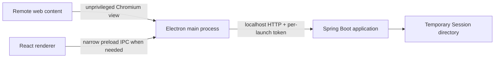

# Architecture

## Processes and responsibilities

Electron owns Chromium/WebContentsView, browser navigation, browser sessions/cookies, browser events, and browser-context media acquisition. Java is the trusted application layer for Quick Session domain behavior, temporary session state, metadata, media validation/storage, and future package services. Keep capture metadata/provenance distinct from byte acquisition: Java may initially fetch ordinary public HTTP(S) media; Electron may later acquire bytes through the relevant Chromium session when request context is required, then provide them for Java to accept, validate, and store. Do not export normal-browser cookies or expose arbitrary privileged fetch IPC to remote content. Authenticated, blob, and video capture are future work.

The product targets macOS and Windows from one shared codebase. Keep core domain and storage formats platform-neutral and isolate OS-specific paths, process launching/tree termination, native integration, and distribution behind narrow boundaries. Resolve app-data paths through platform APIs and pass resolved paths to the owning layer. macOS is the primary development and validation platform; Windows is a target but is not yet tested or fully supported. Future distribution may produce separate artifacts from the shared source tree.

The renderer is currently a React placeholder. `desktop/main.cjs` launches Maven in development, creates a random token, passes it via environment to Spring Boot, and checks the authenticated health endpoint before creating the window. Startup fails closed if Maven exits, authentication fails, or the health check times out. The current scaffold filter requires a token on `/api/**`; before protected data endpoints are added, harden authentication to cover every backend HTTP request and verify path handling through a real server. Remote pages must never receive API access or the token.

The current development scaffold uses fixed loopback port `8765`; it may remain for browser-shell work. Before persistence, Java should bind a backend-selected dynamic loopback port; Electron must use the actual bound port rather than selecting and releasing a port in advance. Establish single-instance/session-writer ownership, stale/dead backend handling, and bounded behavior when the backend is lost before persistent writes. The readiness protocol remains open. On macOS, closing the last window leaves the app active and `activate` recreates the window without relaunching Maven. The Maven process runs in a separate process group so app quit can terminate the Maven/Spring process tree; cross-platform process behavior remains to be validated.

## Security boundaries

The current desktop window enables `contextIsolation` and sandboxing and disables `nodeIntegration`; its preload exposes no API. The scaffold does not yet implement integrated browsing. When implemented, remote website content must run in a dedicated `WebContentsView` and persistent Chromium session, separate from trusted UI state, Quick Session files, and the user's normal browser. Never import normal-browser cookies. Remote content must remain sandboxed, have context isolation and Node integration disabled, receive no privileged preload, filesystem access, backend credentials, or per-launch token. Explicitly control navigation, popups, external protocols, downloads, and permission requests; deny capabilities that have not been implemented. Privileged IPC is available only to registered trusted views and validates sender/frame and arguments. Trusted UI must not navigate to arbitrary remote content. Prevent the remote browser session from accessing Vision Board's loopback backend endpoint as defense in depth. Apply an appropriate Content Security Policy to trusted UI. These are decided requirements for future browsing, not claims about a current browser implementation.

## Native browser composition (next spike)

The existing trusted `BrowserWindow` remains the starting architecture. Before building the browser shell, prove native browser-view placement and tray composition; renderer CSS stacking must not be relied upon to overlay a native `WebContentsView`. Validate a bounded trusted native child view above the browser, with Electron main owning native bounds, order, and lifecycle. Do not use a window-sized transparent overlay that intercepts browser input. The spike must cover hit testing/input, focus restoration, keyboard interaction, resize/minimum-window behavior, Browse → Gallery → Browse switching, browser-state retention while hidden, and explicit view cleanup/disposal. This tray composition is a candidate, not a permanently locked implementation. `BaseWindow` remains an option if the composition proof identifies a concrete reason to change.

The integrated browser profile is persistent and separate from trusted UI state and Quick Session files. Its cookies, logins, and site storage may persist across Vision Board restarts. Quick Session clearing does not clear browser traces. Do not add an application-maintained browsing-history database. Clear Browsing Data, which may clear cookies/site storage/cache and sign users out, is a separate future capability from Clear Session.

## Future capture flow

When capture is implemented, browser-specific detection and capture metadata/provenance should pass through a small normalized request to Java, which owns session/domain behavior. Keep this abstraction small until more than one capture source exists. Standard images are the first planned source; adapters, drag/drop, paste, and extensions are future possibilities.

## Repository modules

- `desktop/`: Electron main/preload and Vite React/TypeScript renderer.
- `backend/`: Spring Boot Maven application.
- `docs/`: product and implementation constraints.

Production backend bundling, runtime packaging, and installers are not configured or decided. macOS and Windows may eventually have separate build artifacts from the shared codebase. Mutable application data must live outside packaged/read-only resources. Signing, notarization, installer design, and runtime packaging remain future decisions.
